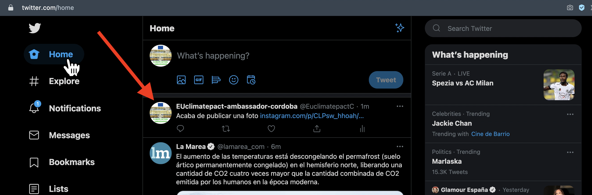

# Cómo publicar en Facebook en Twitter y en Instagram a la vez
Sobran razones y palabras para explicar por qué es necesario que un negocio tenga presencia en todas las RRSS, así que al grano con el tutorial:

### Requisitos:
* Tener cuenta en Instagram
* Tener cuenta en Facebook (de una página)
* Tener cuenta en Twitter
* Tener cuenta en IFFT (si no la tienes, hazte cuenta ahora en https://ifttt.com/home)

## 1. Conectar Instagram a Facebook
**Siguiendo este paso, lo que publiques en instagram, se publicará automaticamente en Facebook.**
Abre Instagram en tu móvil y Facebook en tu ordenador (puedes abrirlo en tu móvil, pero a mí así me es más cómodo) y sigue los pasos en este vídeo:

[Cómo conectar Instagram a Facebook](https://youtu.be/-KVI9e8peUY)

## EN CONSTRUCCION 2. Conectar Instagram a Twitter 
Conecta las fotos de Instagram con twittter a través de IFFT
Si publicas ahora algo en Instagram, aparecerá tal que así publicado en Twitter:

Como queremos que se vea la foto y no un link de ella, tenemos que hacer lo siguiente:
Ve a esta web: https://ifttt.com/applets/AUkTWRJp-instagram-twitter?term=twitter
y sigue las instrucciones de este video:

##  EN CONSTRUCCION 3. Conecta las fotos de insttagram con twittter a ttravés de IFFT
