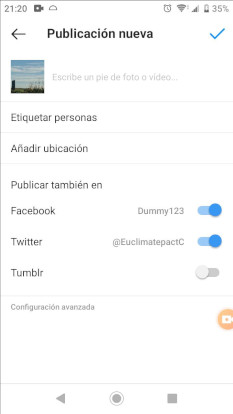

# Cómo publicar en Facebook en Twitter y en Instagram a la vez

Sobran las razones por las que es necesario para un comercio publicar las diferentes RRSS. Así pues, vamos al grano con el tutorial:

### Requisitos:
* Tener cuenta en Instagram
* Tener cuenta en Facebook (de una página)
* Tener cuenta en Twitter
* Tener cuenta en IFFT (si no la tienes, hazte cuenta ahora en https://ifttt.com/home)

## 1. Conectar Instagram a Facebook
**Siguiendo este paso, lo que publiques en instagram, se publicará automaticamente en Facebook.**
Abre Instagram en tu móvil y Facebook en tu ordenador (puedes abrirlo en tu móvil, pero a mí así me es más cómodo) y sigue los pasos en este vídeo:

[Cómo conectar Instagram a Facebook](https://youtu.be/-KVI9e8peUY)

## 2. Cómo conectar Instagram a Twitter
**Siguiendo este paso, lo que publiques en Instagram, se publicará en  Twitter (con foto incluída).**
Si sincronizas Instagram con Twitter (tal y como hemos hecho en el paso 1. con facebook), aparecerá tal que así publicado en Twitter:

Como queremos que se vea la foto y no un link de ella, tenemos que hacer lo siguiente:

Ve a esta web: https://ifttt.com/applets/aVxGRrtD y vuelve a este tutorial tras
seguir las instrucciones de este video:

[Conectar IFTTT twiter instagram](https://youtu.be/TG-JvbMMItk)

**Bien, si ahora publicas en Instagram, aún no se ve en Twitter la foto que hayas publicado**, si no un enlace (MIRA NOTA EN PIE DE PÁGINA). Esto es porque IFTTT tarda al menos unos minutos en traducir ese enlace a foto. Si quieres, vuelve a mirar tu Twitter dentro de unos minutos para ver si el enlace "se ha convertido" en imagen.

A mí me ha tardado algo menos de cinco minutos como puedes ver (flecha roja en la foto):

Y ya estaría!
**¿algo no funciona? ¿algo no es correcto? escríbeme a telegram o whatsapp al 644277210 o email a EUclimatepact-ambassador-cordoba@protonmail.com**

Un abrazo,

Carmen ML

**NOTA PIE DE PÁGINA:**

Asegúrate de que cuando publiques desde instagram, los "checks" estén en azul/ON publicar también Facebook y Twitter tal y como muestra  la siguiente imagen:

